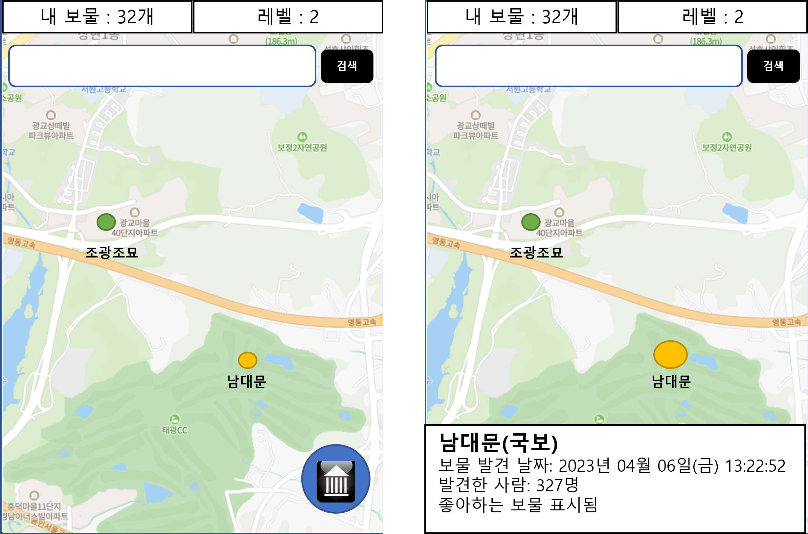
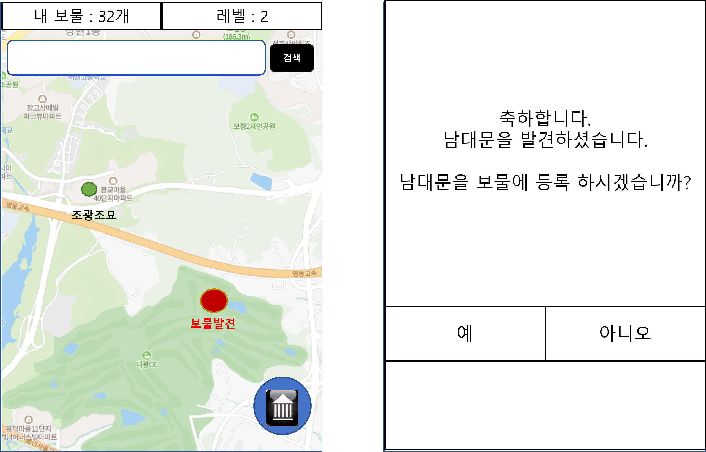

# 대한민국 보물찾기 앱

## Summary
대한민국의 보물을 찾아 보물 지도를 만드는 APP이다.

* 문화재가 있는 위치에 가서 APP을 켜면 지도에 보물이 표시 되고 보물 등록 가능
* 등록한 보물은 지도에서 언제든 볼 수 있음

## Screenshots

## Feature

## Requirements

### API

[문화 재청 API](https://www.cha.go.kr/html/HtmlPage.do?pg=/publicinfo/pbinfo3_0202.jsp&mn=NS_04_04_03)를 사용하여 문화재의 위치와 정보를 가져온다.

Git Convention
--------------

Git Push 규칙은 [GitConvention](docs/GitConvention.md) 문서를 참조한다.

Android Studio IDE setup
------------------------

Additional resources
--------------------

Non-Goals
---------

Support
-------

Third Party Content
-------------------

License
-------

